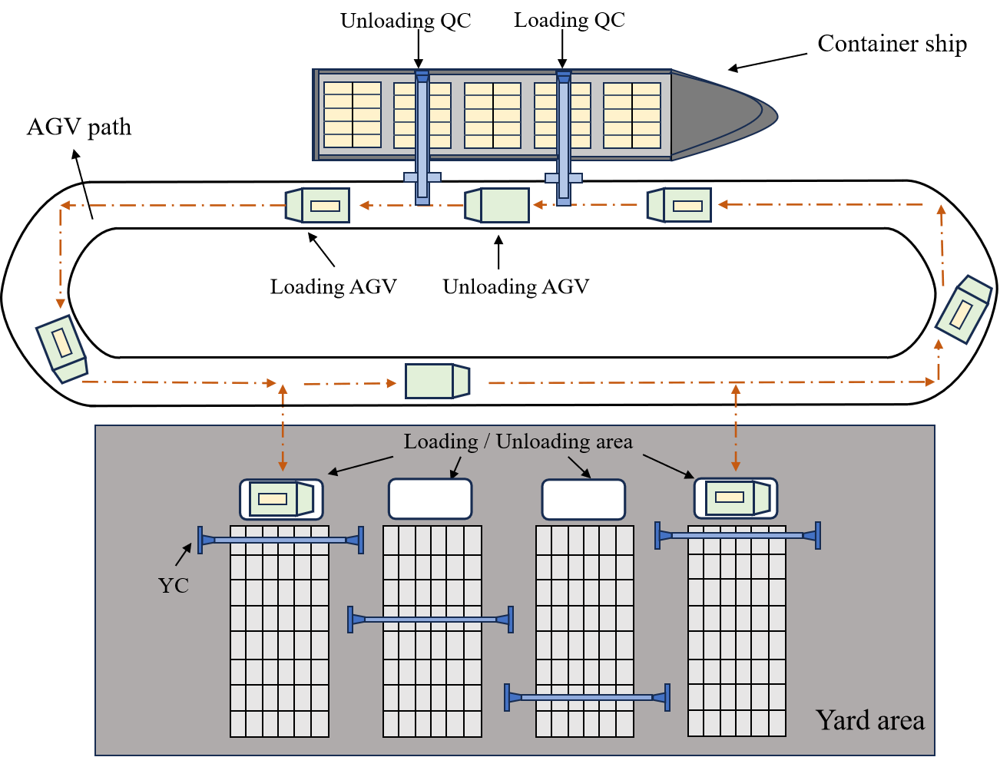
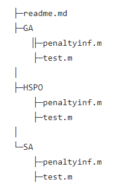
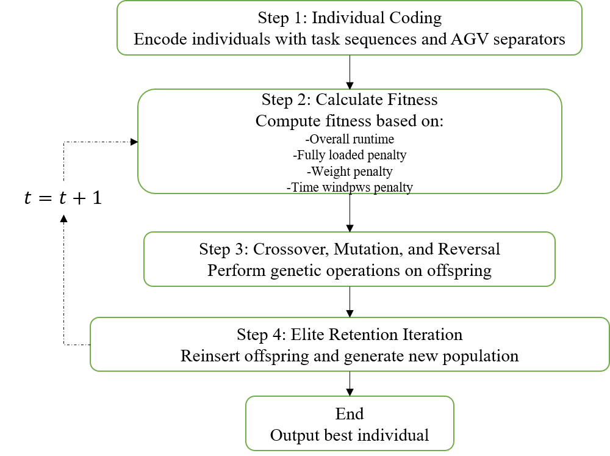

# Efficient AGV Scheduling for Automated Container Terminals: Minimizing Empty Runs with Weight Constraints and Time Windows

Jing Chen, Weijie He, Chaolong Zhang, and Shuyue Wang

## Table of Contents

1. [Abstract](#1-abstract)
2. [Test](#2-test)
3. [GA Algorithm with Penalty Function](#3-GA-algorithm-with-penalty-function)
4. [Simulations and Results](#4-simulations-and-results)
   - [Technical Environment and Tools](#technical-environment-and-tools)
   - [Simulation Setup](#simulation-setup)
   - [Impact of Penalty Coefficients and Genetic Operators](#impact-of-penalty-coefficients-and-genetic-operators)
     - [Impact of Penalty Coefficients on Experimental Results](#impact-of-penalty-coefficients-on-experimental-results)
     - [Impact of Genetic Operators on Experimental Results](#impact-of-genetic-operators-on-experimental-results)
   - [Verification of GA Performance](#verification-of-ga-performance)
5. [Conclusions](#5-conclusions)
6. [Acknowledgments](#6-acknowledgments)

## 1. Abstract

To improve the efficiency of automated container terminals, optimizing the scheduling of Automated Guided Vehicles (AGVs) is essential. Traditional AGV strategies often overlook the issue of empty runs. In contrast, the proposed model aims to minimize the empty runs of AGVs by ensuring each AGV unloads a container at the yard and immediately loads another container before returning to the quay. The key contributions of this study include the integration of weight constraints and time windows into the scheduling model, addressing both the safety and efficiency of AGV operations. A constraint penalty strategy is employed to handle overweight container tasks, and time windows are used to define the loading and unloading sequence for each container, considering the vessel’s berthing time and the operational requirements of the yard. Using a Genetic Algorithm (GA) with penalty functions, the model is solved to obtain the minimum operating time for AGVs. Experimental results using simulated data provided the optimal AGV scheduling sequences, with the GA demonstrating certain advantages over other algorithms. The simulation data and code are available on GitHub for further validation and research.

    

## 2. Test

**Run `test.m` in MATLAB for testing**

## 3. GA Algorithm with Penalty Function

    

## 4. Simulations and Results

### Technical Environment and Tools

- **Operating System**: Windows 11
- **Simulation Tool**: MATLAB R2020a

### Simulation Setup

Based on the actual conditions of the port, the number of quay cranes, AGV travel tracks, and other parameters were simulated. The GA with penalty functions was implemented, and specific simulation parameters were used to validate the model. The results indicate that the proposed model effectively schedules AGVs, maximizing transportation efficiency.

### Impact of Penalty Coefficients and Genetic Operators

#### Impact of Penalty Coefficients on Experimental Results

Different penalty coefficients were tested to evaluate their impact on the experimental results. The findings demonstrate the significance of appropriate parameter settings in achieving optimal AGV scheduling results.

| \(P_f\) | \(P_w\) | \(P_{ql}\) | \(P_{qr}\) | \(P_y\) | \(n_f\) | \(n_w\) | \(n_{ql}\) | \(n_{qr}\) | \(n_{yl}\) | \(n_{yr}\) | Optimized Fitness | Average Runtime | Processing Time (s) |
|--------|--------|--------|--------|--------|--------|--------|--------|--------|--------|--------|----------------|-----------------|-------------|
| 1.0e6  | 1.0e4  | 1.0e3  | 1.0e4  | 1.0e3  | 0.105  | 0.565  | 1.525  | 2.060  | 1.455  | 3.035  | 425242.7117    | 814.2417        | 1540.263597 |
| 1.0e5  | 1.0e3  | 1.0e2  | 1.0e3  | 1.0e2  | 0.030  | 0.730  | 1.520  | 2.705  | 1.380  | 3.440  | 41729.9633     | 825.7983        | 1737.224980 |
| 1.0e4  | 1.0e2  | 1.0e1  | 1.0e2  | 1.0e1  | 0.030  | 0.700  | 1.550  | 2.075  | 1.440  | 3.030  | 4305.3067      | 804.5567        | 1634.771832 |
| 1.0e7  | 1.0e5  | 1.0e4  | 1.0e5  | 1.0e4  | 0.030  | 0.720  | 1.470  | 2.455  | 1.405  | 3.375  | 3968388.915    | 823.4517        | 2129.333379 |
| 1.0e8  | 1.0e6  | 1.0e5  | 1.0e6  | 1.0e5  | 0.060  | 0.685  | 1.530  | 2.420  | 1.465  | 3.260  | 41817978.8283  | 812.3217        | 2213.414671 |
| 1.0e9  | 1.0e7  | 1.0e6  | 1.0e7  | 1.0e6  | 0.055  | 0.705  | 1.505  | 2.47   | 1.500  | 3.370  | 438122489.4967 | 825.62          | 1225.772694 |
| 1.0e7  | 1.0e4  | 1.0e3  | 1.0e4  | 1.0e3  | 0.000  | 0.650  | 0.565  | 10.18  | 1.140  | 10.515 | 2847257.2817   | 1237.1817       | 2113.595202 |
| 1.0e6  | 1.0e5  | 1.0e3  | 1.0e4  | 1.0e3  | 0.075  | 0.070  | 1.450  | 2.770  | 1.360  | 3.665  | 480097.395     | 830.0283        | 1235.725083 |
| 1.0e6  | 1.0e4  | 1.0e2  | 1.0e5  | 1.0e3  | 0.205  | 0.650  | 2.680  | 1.605  | 1.655  | 2.245  | 630248.8983    | 813.815         | 1778.570927 |
| 1.0e6  | 1.0e4  | 1.0e3  | 1.0e4  | 1.0e4  | 2.715  | 0.845  | 2.650  | 0.820  | 1.130  | 0.555  | 3333070.5533   | 750.045         | 2153.561441 |

#### Impact of Genetic Operators on Experimental Results

Different genetic operators were also tested to evaluate their impact on the experimental results. The findings demonstrate the significance of appropriate parameter settings in achieving optimal AGV scheduling results.

| \(p_c\) | \(p_m\) | \(p_r\) | \(n_f\) | \(n_w\) | \(n_{ql}\) | \(n_{qr}\) | \(n_{yl}\) | \(n_{yr}\) | Optimized Fitness | Average Runtime | Processing Time (s) |
|--------|--------|--------|--------|--------|--------|--------|--------|--------|-----------------|-----------------|-----------------|
| 0.3    | 0.3    | 0.3    | 0.045  | 0.715  | 1.425  | 3.315  | 1.525  | 4.120  | 499690.5417     | 837.4133        | 1199.61         |
| 0.4    | 0.4    | 0.4    | 0.030  | 0.715  | 1.535  | 2.630  | 1.480  | 3.550  | 430791.0217     | 829.4417        | 1226.37         |
| 0.5    | 0.5    | 0.5    | 0.055  | 0.720  | 1.570  | 2.560  | 1.420  | 3.280  | 418680.35       | 828.2033        | 1226.59         |
| 0.6    | 0.6    | 0.6    | 0.030  | 0.845  | 1.590  | 1.865  | 1.465  | 2.800  | 323858.4633     | 800.1567        | 1239.48         |
| 0.7    | 0.7    | 0.7    | 0.000  | 0.815  | 1.485  | 2.005  | 1.520  | 2.865  | 302018.34       | 804.7383        | 1253.68         |
| 0.8    | 0.8    | 0.8    | 0.010  | 0.705  | 1.620  | 1.635  | 1.555  | 2.645  | 292620.9717     | 790.4733        | 1281.24         |
| 0.9    | 0.9    | 0.9    | 0.000  | 0.695  | 1.510  | 1.690  | 1.480  | 2.670  | 294271.0917     | 804.2817        | 1294.99         |
| 0.99   | 0.99   | 0.99   | 0.045  | 0.820  | 1.590  | 1.420  | 1.625  | 2.470  | 301600.4967     | 797.355         | 1306.81         |

### Verification of GA Performance

The performance of the GA was compared with Hybrid Particle Swarm Optimization (HPSO) and Simulated Annealing (SA) algorithms. The GA showed superior performance, particularly in scenarios with a higher number of task points.
| **Task Points**    | Algorithms | \(n_f\) | \(n_w\) | \(n_{ql}\) | \(n_{qr}\) | \(n_{yl}\) | \(n_{yr}\) | Optimized Fitness | Average Runtime | Processing Time (s) |
|--------------------|------------|--------|--------|--------|--------|--------|--------|-----------------|-----------------|-----------------|
| **12 Task Points** | GA         | 0.000  | 0.035  | 0.000  | 0.250  | 1.000  | 0.500  | 52448.6617      | 401.995         | 1084.766480 |
|                    | HPSO       | 0.000  | 0.055  | 0.000  | 0.000  | 1.005  | 0.000  | 25461.1600      | 366.160         | 2147.757679 |
|                    | SA         | 0.000  | 0.310  | 0.000  | 1.565  | 1.000  | 2.630  | 306869.3750     | 542.708         | 1275.348610 |
| **24 task points** | GA         | 0.000  | 0.755  | 1.495  | 1.570  | 1.545  | 2.495  | 262806.2650     | 793.7067        | 1610.748516 |
|                    | HPSO       | 0.770  | 1.710  | 1.165  | 5.230  | 4.515  | 4.530  | 1740751.3817    | 794.0983        | 2943.605938 |
|                    | SA         | 0.095  | 0.595  | 1.425  | 3.425  | 1.350  | 3.925  | 579226.2617     | 864.595         | 2105.262004 |
| **36 task points** | GA         | 1.040  | 1.300  | 4.605  | 10.075 | 3.135  | 6.845  | 2039088.2133    | 1298.6033       | 2007.869260 |
|                    | HPSO       | 3.345  | 1.970  | 3.295  | 17.830 | 5.490  | 12.675 | 7543843.1933    | 1306.5267       | 2878.695749 |
|                    | SA         | 14.360 | 0.695  | 4.355  | 16.075 | 0.840  | 15.120 | 16658347.4050   | 1292.405        | 1768.407095 |

**Note:** This experiment was conducted using two different machines. As a result, the processing time may vary between machines. To obtain accurate experimental processing time, we reran the program. Therefore, there are minor discrepancies between the data in the GitHub tables and the results presented in the paper. Additionally, due to the nature of the Genetic Algorithm (GA), the results may slightly differ between experiments. Therefore, the provided runtime and result values are for reference only.

## 5. Conclusions

To enhance the safety and transport efficiency of the terminal, the model aims to minimize the empty trip rate of AGVs by focusing on their operation at full capacity. The focus is on the safe transport and efficiency of AGVs, striving to control overload situations and reduce operational time. We employ a GA with penalty functions and design constraints including fully loaded constraints, weight restrictions, and time windows. Simulation results demonstrate that the algorithm effectively addresses this issue and identifies the optimal transport sequence for AGVs. When compared with algorithms based on HPSO and SA, GA exhibits superior performance. However, the model established requires an equal number of containers to be unloaded and loaded. When encountering unequal situations, it is necessary to split them into several equally sized task groups for study to ensure the applicability and accuracy of the model. Moreover, this experiment involved three algorithms, and in the future, we will consider introducing more heuristic algorithms to improve the precision and efficiency of problem-solving.

## Acknowledgments

We would like to acknowledge the contributions of the College of Computer Science and Engineering, Shandong University of Science and Technology, for their support.
