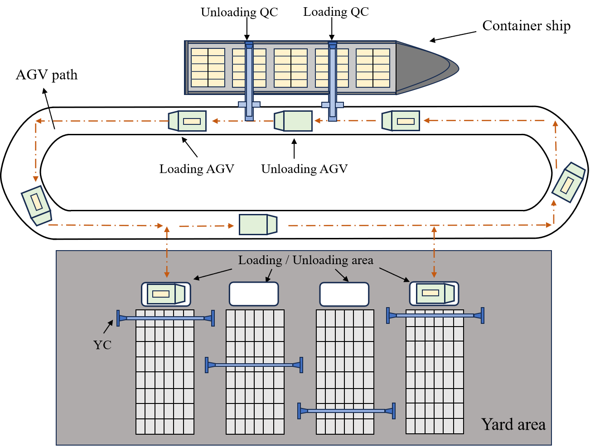

# Efficient AGV Scheduling for Automated Container Terminals: Minimizing Empty Runs with Weight Constraints and Time Windows

Jing Chen, Weijie He, Chaolong Zhang, and Shuyue Wang

## 1. Abstract

To improve the efficiency of automated container terminals, optimizing the scheduling of Automated Guided Vehicles (AGVs) is essential. Traditional AGV strategies often overlook the issue of empty runs. In contrast, our proposed model aims to minimize the empty runs of AGVs by ensuring each AGV unloads a container at the yard and immediately loads another container before returning to the quay. To ensure safe and efficient transportation, we employ a constraint penalty strategy to handle overweight container tasks. For the quay and the yard, we consider the vessel’s berthing time and the operational requirements of the yard, using time windows to define the loading and unloading sequence for each container. Early arrivals necessitate waiting, while delays affect overall terminal operations. Using a Genetic Algorithm (GA) with penalty functions, we solve the model, considering weight constraints for AGVs and time windows for loading and unloading tasks. By ensuring AGVs are fully loaded, we obtain the minimum operating time for AGVs and the optimal sequence for AGV operations.



## 2. Test


**Run `test.m` in MATLAB for testing and `penaltyinf.m` for test averages**

## 3. Simulations and Results

### Technical Environment and Tools

- **Operating System**: Windows 11
- **Simulation Tool**: MATLAB R2020a

### Simulation Setup

Based on the actual conditions of the port, the number of quay cranes, AGV travel tracks, and other parameters were simulated. The GA with penalty functions was implemented, and specific simulation parameters were used to validate the model. The results indicate that the proposed model effectively schedules AGVs, maximizing transportation efficiency.

### Impact of Penalty Coefficients and Genetic Operators

Different penalty coefficients and genetic operators were tested to evaluate their impact on the experimental results. The findings demonstrate the significance of appropriate parameter settings in achieving optimal AGV scheduling results.

### Verification of GA Performance

The performance of the GA was compared with Hybrid Particle Swarm Optimization (HPSO) and Simulated Annealing (SA) algorithms. The GA showed superior performance, particularly in scenarios with a higher number of task points.

## 4. Conclusions

To enhance the safety and transport efficiency of the terminal, our model aims to minimize the empty trip rate of AGVs by focusing on their operation at full capacity. We concentrate on the safe transport and efficiency of AGVs, striving to control overload situations and reduce operational time. We employ a Genetic Algorithm (GA) with penalty functions and design constraints including fully loaded constraints, weight restrictions, and time windows. Simulation results demonstrate that our algorithm effectively addresses this issue and identifies the optimal transport sequence for AGVs. When compared with algorithms based on Hybrid Particle Swarm Optimization (HPSO) and Simulated Annealing (SA), GA exhibits superior performance. However, the model we established requires an equal number of containers to be unloaded and loaded. When encountering unequal situations, it is necessary to split them into several equally sized task groups for study to ensure the applicability and accuracy of the model. Moreover, this experiment involved three algorithms, and in the future, we will consider introducing more heuristic algorithms to improve the precision and efficiency of problem-solving.

## How to Use

1. Clone the repository:
   ```bash
   git clone https://github.com/yourusername/AGV-Scheduling.git
   ```
2. Navigate to the project directory:
   ```bash
   cd AGV-Scheduling
   ```
3. Follow the instructions in the `setup.md` file to set up your environment and run the simulations.

## Acknowledgments

We would like to acknowledge the contributions of the College of Computer Science and Engineering, Shandong University of Science and Technology, for their support.

