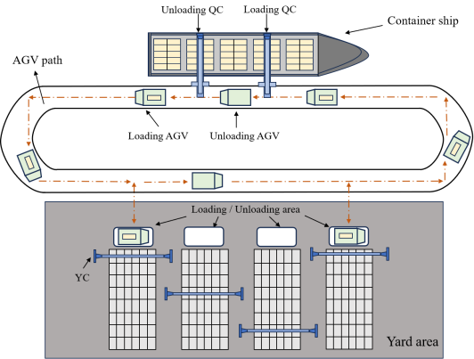

---

---

# Efficient AGV Scheduling for Automated Container Terminals: Minimizing Empty Runs with Weight Constraints and Time Windows

Jing Chwn, Weijie He , Chaolong Zhang, and Shuyue Wang

## 1. **Abstract** 

To improve the efficiency of automated container terminals, optimizing the scheduling of Automated Guided Vehicles (AGVs) is essential. Traditional AGV strategies often overlook the issue of empty runs. In contrast, our proposed model aims to minimize the empty runs of AGVs. This means each AGV unloads a container at the yard and immediately loads another container before returning to the quay. To ensure safe and efficient transportation, we employ a constraint penalty strategy to handle overweight container tasks. For the quay and the yard, we consider the vessel’s berthing time and the operational requirements of the yard, using time windows to define the loading and unloading sequence for each container. Early arrivals necessitate waiting, while delays affect overall terminal operations. Using a Genetic Algorithm (GA) with penalty functions, we solve the model, considering weight constraints for AGVs and time windows for loading and unloading tasks. By ensuring AGVs are fully loaded, we obtain the minimum operating time for AGVs and the optimal sequence for AGV operations.

## 2. Test

├── AGV-Scheduling
│ ├── readme.md
│ ├── GA
│ │ ├── penaltyinf.m
│ │ └── test.m
│ ├── HSPO
│ │ ├── penaltyinf.m
│ │ └── test.m
│ └── SA
│ ├── penaltyinf.m
│ └── test.m
└── Test

**Run test.m in matlab for testing and penaltyinf.m for test averages**

## **3. Simulations and results**

### **Table 1.** Impact of different penalty coefficients on the number of non-compliant task points.

| Pf         | Pw       | Pql     | Pqr      | Py      | Nf    | Nw    | Nql   | Nqr   | Nyl   | Nyr    |
| :--------- | :------- | :------ | :------- | :------ | :---- | :---- | :---- | :---- | :---- | :----- |
| 1000000    | 10000    | 1000    | 10000    | 1000    | 0.105 | 0.565 | 1.525 | 2.06  | 1.455 | 3.035  |
| 100000     | 1000     | 100     | 1000     | 100     | 0.03  | 0.73  | 1.52  | 2.705 | 1.38  | 3.44   |
| 10000      | 100      | 10      | 100      | 10      | 0.03  | 0.7   | 1.55  | 2.075 | 1.44  | 3.03   |
| 10000000   | 100000   | 10000   | 100000   | 10000   | 0.03  | 0.72  | 1.47  | 2.455 | 1.405 | 3.375  |
| 100000000  | 1000000  | 100000  | 1000000  | 100000  | 0.06  | 0.685 | 1.53  | 2.42  | 1.465 | 3.26   |
| 1000000000 | 10000000 | 1000000 | 10000000 | 1000000 | 0.055 | 0.705 | 1.505 | 2.47  | 1.5   | 3.37   |
| 10000000   | 10000    | 1000    | 10000    | 1000    | 0     | 0.65  | 0.565 | 10.18 | 1.14  | 10.515 |
| 1000000    | 100000   | 1000    | 10000    | 1000    | 0.075 | 0.07  | 1.45  | 2.77  | 1.36  | 3.665  |
| 1000000    | 10000    | 100     | 100000   | 1000    | 0.205 | 0.65  | 2.68  | 1.605 | 1.655 | 2.245  |
| 1000000    | 10000    | 1000    | 10000    | 10000   | 2.715 | 0.845 | 2.65  | 0.82  | 1.13  | 0.555  |

### **Table 2.** Impact of different penalty coefficients on fitness and runtime.

| Pf         | Pw       | Pql     | Pqr      | Py      | Optimized Fitness | Average Runtime |
| ---------- | -------- | ------- | -------- | ------- | ----------------- | --------------- |
| 1000000    | 10000    | 1000    | 10000    | 1000    | 425242.7117       | 814.2417        |
| 100000     | 1000     | 100     | 1000     | 100     | 41729.9633        | 825.7983        |
| 10000      | 100      | 10      | 100      | 10      | 4305.3067         | 804.5567        |
| 10000000   | 100000   | 10000   | 100000   | 10000   | 3968388.915       | 823.4517        |
| 100000000  | 1000000  | 100000  | 1000000  | 100000  | 41817978.8283     | 812.3217        |
| 1000000000 | 10000000 | 1000000 | 10000000 | 1000000 | 438122489.4967    | 825.62          |
| 10000000   | 10000    | 1000    | 10000    | 1000    | 2847257.2817      | 1237.1817       |
| 1000000    | 100000   | 1000    | 10000    | 1000    | 480097.395        | 830.0283        |
| 1000000    | 10000    | 100     | 100000   | 1000    | 630248.8983       | 813.815         |
| 1000000    | 10000    | 1000    | 10000    | 10000   | 3333070.5533      | 750.045         |

### **Table 3.** Impact of different probability combinations on the number of non-compliant task points.

| Pc   | Pm   | Pr   | Nf    | Nw    | Nql   | Nqr   | Nyl   | Nyr   |
| ---- | ---- | ---- | ----- | ----- | ----- | ----- | ----- | ----- |
| 0.3  | 0.3  | 0.3  | 0.115 | 0.73  | 1.385 | 3.475 | 1.455 | 4.15  |
| 0.4  | 0.4  | 0.4  | 0.015 | 0.725 | 1.435 | 3.225 | 1.35  | 3.905 |
| 0.5  | 0.5  | 0.5  | 0.045 | 0.815 | 1.425 | 2.375 | 1.465 | 3.225 |
| 0.6  | 0.6  | 0.6  | 0.06  | 0.6   | 1.495 | 1.825 | 1.485 | 2.71  |
| 0.7  | 0.7  | 0.7  | 0.015 | 0.725 | 1.505 | 1.935 | 1.535 | 2.84  |
| 0.8  | 0.8  | 0.8  | 0.015 | 0.8   | 1.455 | 1.875 | 1.515 | 2.815 |
| 0.9  | 0.9  | 0.9  | 0.015 | 0.785 | 1.45  | 1.505 | 1.63  | 2.535 |
| 0.99 | 0.99 | 0.99 | 0     | 0.82  | 1.565 | 1.265 | 1.535 | 2.28  |

### **Table 8.** Impact of different probability combinations on fitness and runtime.

| Pc   | Pm   | Pr   | Optimized Fitness | Average Runtime |
| ---- | ---- | ---- | ----------------- | --------------- |
| 0.3  | 0.3  | 0.3  | 594119.8133       | 851.1033        |
| 0.4  | 0.4  | 0.4  | 461240.9083       | 842.3867        |
| 0.5  | 0.5  | 0.5  | 406082.6883       | 821.37          |
| 0.6  | 0.6  | 0.6  | 368840.9783       | 806.175         |
| 0.7  | 0.7  | 0.7  | 315243.1767       | 803.505         |
| 0.8  | 0.8  | 0.8  | 320208.15         | 803.9883        |
| 0.9  | 0.9  | 0.9  | 294437.6317       | 797.4367        |
| 0.99 | 0.99 | 0.99 | 271655.145        | 789.7133        |

## **3. Conclusions**

To enhance the safety and transport efficiency of the terminal, our model aims to minimize the empty trip rate of AGVs by focusing on their operation at full capacity. We concentrate on the safe transport and efficiency of AGVs, striving to control overload situations and reduce operational time. We employ a Genetic Algorithm (GA) with penalty functions and design constraints including fully loaded constraints, weight restrictions, and time windows. Simulation results demonstrate that our algorithm ef-fectively addresses this issue and identifies the optimal transport sequence for AGVs. When compared with algorithms based on Hybrid Particle Swarm Optimization (HPSO) and Simulated Annealing (SA), GA exhibits superior performance. However, the model we established requires an equal number of containers to be unloaded and loaded. When encountering unequal situations, it is necessary to split them into several equally sized task groups for study to ensure the applicability and accuracy of the model. Moreover, this experiment involved three algorithms, and in the future, we will consider introducing more heuristic algorithms to improve the precision and efficiency of problem-solving.
